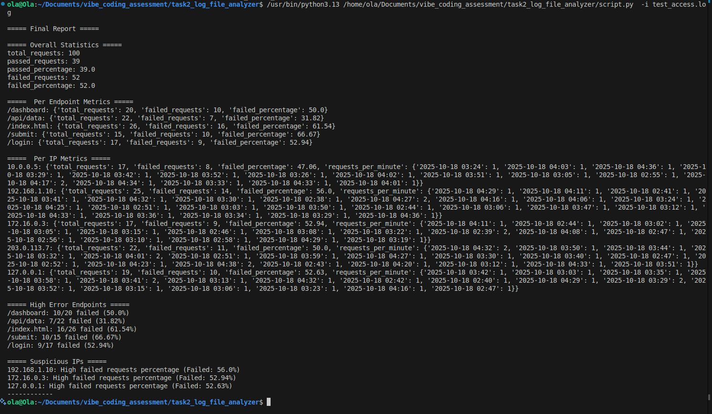

# Log File Analyzer

## Description
The **Log File Analyzer** is a Python-based tool designed to help DevOps teams and developers efficiently analyze web server logs (Apache/Nginx). It parses log files, computes comprehensive traffic statistics, identifies potential issues such as high error rates and suspicious IP activity, and generates both human-readable summaries and machine-readable JSON reports.

---

## Table of Contents
- [Project Structure](#project-structure)  
- [Installation](#installation)  
- [Usage](#usage)  
- [Features](#features)  
- [Screenshots / Demo](#screenshots--demo)  
- [GitHub repository](#github-repository)

---

## Project Structure
The project is organized into modular components to ensure maintainability and clarity:
 ```text
 vibe_coding_assessment/
    └── task2_log_file_analyzer/
        ├── constants.py # Thresholds and configuration constants
        ├── parser.py # Input parser, log line parser, output parser
        ├── statistics_calculator.py # Functions to calculate overall, per-endpoint, and per-IP statistics
        ├── issues_detector.py # Functions to detect high-error endpoints and suspicious IPs
        ├── script.py # Main script to run the analysis
        └── README.md # Project documentation
```


---

## Installation
1. **Navigate to the project directory:**
```bash
cd vibe_coding_assessment/task2_log_file_analyzer
```

2. Ensure Python 3.8+ is installed. You may want to create a virtual environment:
```bash
python -m venv venv
source venv/bin/activate  # Linux/macOS
venv\Scripts\activate     # Windows
```

---
## Usage
Run the log file analyzer with the following command:
```bash
python script.py -i <path_to_log_file> -o <output_report.json> -v
```

Arguments:

    - i, --input : Path to the web server log file to analyze (required)

    - o, --output: Path to save the JSON report (default: report.json)

    - v, --verbose: Enable verbose console output (optional)

Example:
```bash 
python script.py -i logs/access.log -o reports/report.json -v
```

After execution:

  - A human-readable summary is printed to the console.

  - A JSON report is generated containing overall statistics, per-endpoint/IP metrics, and detected issues.

---
## Features

- Log Parsing: Efficient parsing of Apache/Nginx log lines, handling malformed entries gracefully.

- Overall Statistics: Total requests, passed/failed counts, and percentages.

- Per-Endpoint Metrics: Requests and failure percentages for each endpoint.

- Per-IP Metrics: Requests per IP, requests per minute, passed/failed metrics.

- Issue Detection:

    - High-error endpoints flagged based on configurable thresholds.

    - Suspicious IP detection for excessive requests or high failure percentages.

- Output:

    - Human-readable console summaries.

    - JSON report for integration or further automation.

    - Modular Design: Separation of parsing, statistics calculation, and issue detection for maintainability and testability.

    - Performance: Optimized for large log files using streaming and efficient aggregations.
---

## Screenshots / Demo

Console Output Example:


---

## GitHub repository

- Github repo link: https://github.com/ola172/task2_log_file_analyzer.git

---